<p align="center">
  
</p>

<p align="center">
  <em>一只会记住你、也能去好友电脑旅行的 AI 桌宠 —— 你的桌面是它的屿，它的记忆是星光。</em>
</p>

<p align="center">
  <a href=".github/workflows/ci.yml"></a>
  
  
  
  
  
</p>

## ✨ 这是什么

**星屿（StarIsle）** 是一款 Windows + macOS 的 Electron 桌宠。每位用户的桌面都是一座"屿"，星屿就住在那里——它记得与你相处的每一点星光，也能跃迁去好友的屿做客：**异步跨电脑拜访**，你不在时它也在路上。

完整产品规格见 [设计稿](docs/superpowers/specs/2026-08-01-ai-social-desktop-pet-design.md)。

## 🪐 亮点

| 亮点                 | 为什么值得                                                                 |
| -------------------- | -------------------------------------------------------------------------- |
| 🚀 异步跨电脑拜访    | 桌宠去好友桌面旅行（未发现任何已上线产品支持此功能）                       |
| 🌌 可治理的 AI 记忆  | 私人记忆与共同记忆分表、分权、分场景检索；用户可见、可改、可删             |
| 🧬 graph engineering | AI 流程建模为显式状态图（loop engineering 的进阶），可观测、可重放、可恢复 |
| 🏝️ 自建后端          | Postgres + Node（Hono HTTP + WebSocket + 自建 Auth），软件费 0             |

## ⭐ 签名角色：星屿

- **React SVG 原创角色**：星尾狐猫"星屿"由原生 React SVG 绘制（`apps/desktop/src/pet/star-isle-visual.tsx`），非贴图、非 Live2D
- **启动即见**：无需登录即可显示、拖动、摸头（touch 动作）、本地模式聊天（气泡回复）
- **双击打开面板**：双击星屿身体打开面板窗（登录页/聊天/好友页）
- **穿透恢复**：手动开启整窗穿透后，只能通过托盘菜单恢复（`toggle-pass-through`；8.4 不可恢复事故为 0）
- **位置记忆**：拖动位置持久化，重启后按保存的位置还原（`position-store`）
- **不使用 PetDex/Live2D 资产**：仅借鉴其交互思路（透明浮窗/拖动/气泡），角色、代码、素材全部原创（见设计稿星屿章节边界）
- **平台**：Windows 10/11 优先（CI 已加 `star-isle-windows` job 真机验证）；macOS 待后续

## 🚀 启航（快速开始）

前置：Node ≥ 20.11、pnpm ≥ 9；Postgres 16+ 可选（本地聊天可离线）。

```bash
# ① 安装依赖
pnpm install

# ② 质量门禁（提交前过一遍，CI 同样执行）
pnpm format:check   # 格式化检查
pnpm typecheck      # 全 workspace 类型检查（含 references 链）
pnpm test           # 单测（alias 到源码，不依赖 dist）

# ③ 点亮星屿 —— 启动桌面端（renderer 直接吃共享包源码，无需先 build）
pnpm dev
```

后端（聊天/好友/拜访的中继站；不启动则桌宠降级为本地模式）：

```bash
docker run -d --name pet-pg -e POSTGRES_PASSWORD=pet -p 5432:5432 postgres:16   # 或使用本机 Postgres 16+
cp apps/server/.env.example apps/server/.env.local   # 填 DATABASE_URL / JWT_SECRET
pnpm dev:server    # 启动（自动应用未执行的 migrations，幂等）
```

## 🧭 星图（项目结构）

```
ai-social-desktop-pet/
├── apps/
│   ├── desktop/     Electron 桌面端（透明窗 + React + 原创 SVG 角色）
│   ├── server/      自建后端（Hono HTTP + WebSocket + 自建 Auth + migrations）
│   └── landing/     Landing 页（waitlist 报名 / 邀请码兑换）
├── packages/
│   ├── protocol/    ⭐ 单一真相源：共享类型 + zod schema（三端复用）
│   ├── config/      feature flags、模型路由、限额/保留期
│   ├── ai-graph/    ⭐ 状态图运行时 + chat-flow / memory-extract 图
│   ├── pet-state/   桌宠状态机（纯逻辑，可单测）
│   └── ui/          共享 React 组件
├── e2e/             Playwright 端到端（11 个 spec）
├── docs/            设计稿、状态快照、部署指南
└── tooling/         tsconfig / eslint 共享配置
```

| 层       | 技术                                                                      |
| -------- | ------------------------------------------------------------------------- |
| 桌面端   | Electron + electron-vite + React + TypeScript                             |
| 表现     | 原创 React SVG 角色；Live2D Cubism SDK for Web 待 V-1 许可确认后引入      |
| 后端     | 自建（D-13）：Postgres 社区版 + Node（Hono HTTP + WebSocket + 自建 Auth） |
| 记忆     | PostgreSQL + pgvector（HNSW + hybrid 检索）                               |
| Graph    | 自研轻量状态图运行时（`@pet/ai-graph`，LangGraph 启发，依赖无关）         |
| Monorepo | pnpm workspaces                                                           |

> **后端选型（2026-08-01 依 D-13）**：放弃 Supabase 托管改为自建 Postgres + Node——软件费 0（VPS 成本见设计稿 12.6）；migrations（纯 SQL + pgvector）原样复用，记忆检索方案不变；AI Gateway 直接在 Node 服务跑 `@pet/ai-graph`。

## 📡 信号表（常用命令）

| 你说               | 触发                                                                   |
| ------------------ | ---------------------------------------------------------------------- |
| `pnpm dev`         | 启动桌宠（桌宠窗 + 面板窗）                                            |
| `pnpm dev:server`  | 启动自建后端（Hono HTTP + WebSocket）                                  |
| `pnpm migrate`     | 手动应用 Postgres migrations                                           |
| `pnpm test`        | 单测（vitest，alias 到源码）                                           |
| `pnpm test:e2e`    | 端到端（自动预置 alice/bob 账号与好友；后端不可达时相关用例自动 skip） |
| `pnpm package:win` | 打包 Windows 安装包（NSIS per-user，13.1）                             |
| `pnpm bench:ws`    | WebSocket 并发压测（需服务 + BENCH_TOKEN）                             |

## 🛡️ 安全与约定

- **8.3 安全基线**：`nodeIntegration:false` / `contextIsolation:true` / `sandbox:true` / 严格 CSP / IPC 通道 zod 校验 / 外部链接交系统浏览器 / 模型供应商密钥只存服务端环境变量
- **refresh token 只存哈希**：`refresh_sessions.token_hash = sha256(token)`，明文绝不下落（9.8 轮换即撤销，防重放）
- **RLS 是纵深防御不是主防线**：应用层权限校验为主，每个业务事务开头 `set local request.jwt.claims`（`rlsClaimsJson`）
- **记忆先权限后检索**：先 owner + visibility + purpose + sensitivity + 时间有效性 + `memory_status=active` 过滤，再 hybrid 检索
- **审核走免费 Moderation**：输入输出审核不与对话同档付费模型（12.5）

### 为什么自研 graph runtime 而非直接用 LangGraph.js

1. 设计稿 10.1 是固定 DAG（非自由 agent 探索），轻量 runtime（~300 LOC）足够且更可控
2. 依赖无关 → 可在 Node（`apps/server` 原生加载）/ 浏览器（测试）两处复用
3. 节点函数保持纯函数，未来可无痛迁移到 LangGraph.js

运行时见 [`packages/ai-graph/src/runtime/`](packages/ai-graph/src/runtime/)，核心图定义见 [`chat-flow.ts`](packages/ai-graph/src/graphs/chat-flow.ts)。

## 🗓️ 当前状态

**2026-08-03 快照**（详见 [status-2026-08-03](docs/status-2026-08-03.md)）：

- 单测 **485**（56 文件）/ e2e **25/25** / star-isle e2e **7/7**；format / lint / typecheck / build 全绿
- 后端全链路真实可用：Auth / 邀请 / 礼物 / 拜访 / sync / chat(SSE) + WS 实时推送
- 桌面端：登录 / 好友 / 聊天 / 深链邀请 / 本地降级全部可用；贴底居中、拖动持久化、气泡、右键菜单、托盘穿透经真实截图 + e2e 验收
- 封测准备：`pnpm package:win` 出安装包；部署指南见 [docs/deployment.md](docs/deployment.md)

## 🤝 参与贡献

每个功能该改哪个包，见 [AGENTS.md](AGENTS.md) 的"功能落点速查"表；8 条关键约定（类型单一真相源 / 图而非过程函数 / 数据库提交即真相 / RLS 纵深防御等）勿违反。

## 📜 来源与许可

- 本项目 **UNLICENSED（私有）**
- 星屿角色、代码、素材全部原创；仅借鉴 PetDex / Live2D 的交互思路（透明浮窗 / 拖动 / 气泡），不使用其任何资产
- 产品规格与决策依据：[设计稿](docs/superpowers/specs/2026-08-01-ai-social-desktop-pet-design.md) · [决策清单](docs/superpowers/specs/2026-08-01-ai-social-desktop-pet-review-checklist.md)

<p align="center"><sub>────── ⭐ 点亮星屿 · 2026 · 跨平台 AI 社交桌宠 ⭐ ──────</sub></p>
